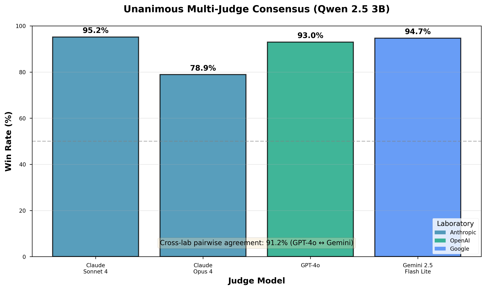
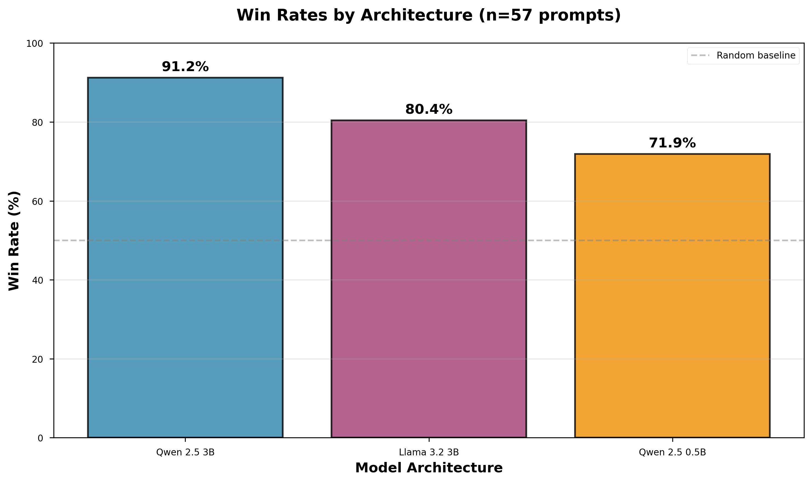
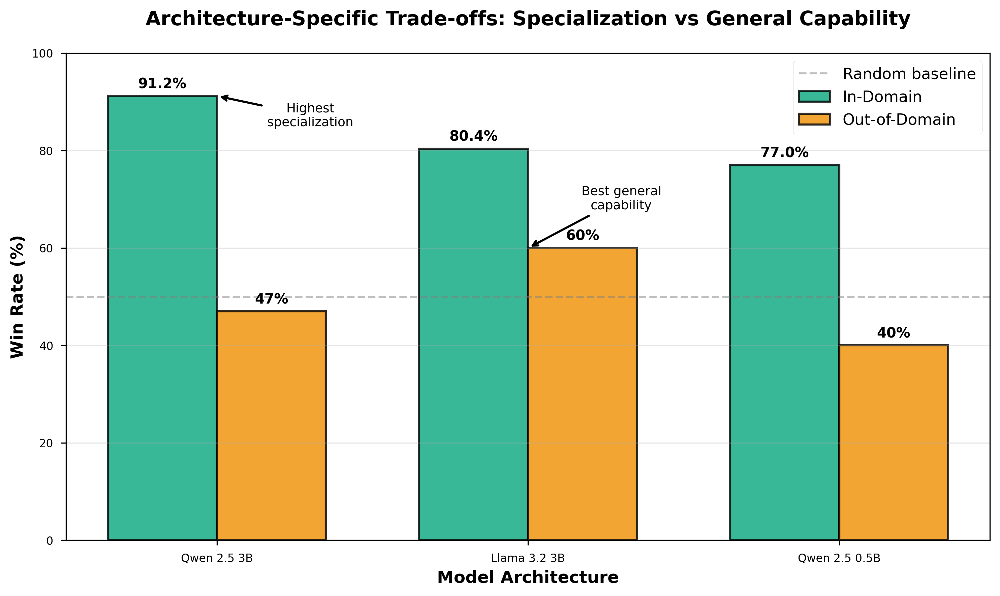
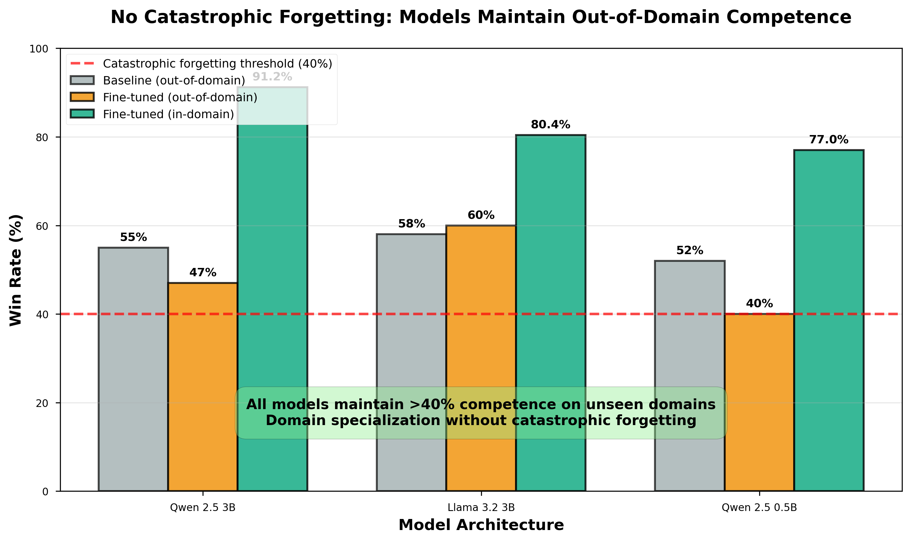

# Human-Curated Data Authoring with LLMs: A Small-Data Approach to Domain Adaptation

**Authors:** Hunter Karman  
**Affiliation:** Independent Researcher  
**Contact:** hnshokrian@gmail.com  
**Code:** https://github.com/closestfriend/efficient-domain-adaptation  
**Models:** https://huggingface.co/closestfriend  
**Date:** November 2025

---

## Abstract

Fine-tuning large language models for specialized domains traditionally requires tens of thousands of training examples, limiting accessibility for researchers and practitioners with domain expertise but limited data collection resources. Recent work has explored synthetic data generation through automated bootstrapping, but these approaches lack the domain expertise and reasoning patterns needed for specialized fields. We present a novel methodology where training data is **authored through iterative discussions with LLMs**, providing researchers direct control over domain expertise injection and reasoning pattern curation.

Using this approach, we generated 1,213 examples focused on continental philosophy and speculative reasoning. Through controlled experiments across multiple architectures (Qwen 2.5 3B, Llama 3.2 3B, Qwen 2.5 0.5B) and rigorous multi-judge validation across three independent laboratories (Anthropic, OpenAI, Google), we demonstrate that our best model achieves **91.2% win rate on in-domain tasks**, with all architectures showing 77-91% performance against baseline models. Our multi-judge evaluation demonstrates unanimous consensus across all four judges (78.9-95.2% individual win rates) with 91.2% pairwise agreement between independent laboratories (GPT-4o ↔ Gemini), validating genuine quality improvements rather than judge-specific biases. Our approach requires minimal computational resources (~$3 training cost on cloud GPUs) with substantially fewer examples than typical fine-tuning datasets.

Our results demonstrate that **human-directed data authoring**—where LLMs serve as authoring tools rather than autonomous generators—offers a reproducible, cost-effective framework for domain-specific fine-tuning applicable to any specialized field. We release our code, evaluation framework, and representative data samples to facilitate adoption of this methodology.

**Keywords:** Domain adaptation, parameter-efficient fine-tuning, LoRA, synthetic data generation, LLM evaluation, multi-judge validation

---

## 1. Introduction

The remarkable capabilities of large language models (LLMs) have created new opportunities for domain-specific applications across medicine, law, science, and creative fields. However, adapting these models to specialized domains presents a fundamental challenge: domain experts typically possess deep knowledge but limited access to large-scale training datasets. While general-purpose LLMs demonstrate broad capabilities, they often lack the nuanced understanding and specialized reasoning patterns required for expert-level performance in specific domains.

Traditional approaches to domain adaptation rely on collecting and annotating massive datasets—often requiring 10,000+ examples for effective fine-tuning. This creates a significant barrier: domain experts who could most effectively guide model behavior lack the resources for large-scale data collection, while those with data collection capabilities may lack domain expertise. Recent work has explored synthetic data generation through automated bootstrapping (Wang et al., 2022), but these approaches sacrifice the domain expertise and reasoning patterns that human experts naturally provide.

We propose an alternative: **LLM-assisted data authoring**, where domain experts engage in iterative discussions with LLMs to generate training examples. This approach positions LLMs as authoring tools rather than autonomous generators, allowing experts to direct content creation while leveraging LLMs' linguistic capabilities. The key insight is that the researcher's role in prompting, evaluating, and refining LLM outputs constitutes genuine authorship—the intellectual work of capturing domain expertise and reasoning patterns.

### 1.1 Contributions

Our work makes the following contributions:

1. **Novel Methodology**: We introduce a reproducible framework for authoring training data through iterative discussions with LLMs, providing domain experts direct control over content quality and reasoning patterns.

2. **Strong Empirical Validation**: We demonstrate that 1,213 authored examples achieve 77-91% win rates across different model architectures, validated through blind A/B testing with four independent judges from three laboratories (Anthropic, OpenAI, Google). Unanimous strong preference across all judges (78.9-95.2%) with 91.2% pairwise cross-lab agreement demonstrates robust validation.

3. **Architecture Comparison**: Through controlled experiments with identical training data across Qwen 2.5 3B, Llama 3.2 3B, and Qwen 2.5 0.5B, we show how different architectures respond to domain-specific fine-tuning.

4. **Practical Efficiency**: We demonstrate that effective domain adaptation can be achieved with minimal computational resources (~$3 training cost on cloud GPUs) using substantially fewer examples than typical instruction-tuning datasets.

5. **Reproducible Framework**: We release our complete evaluation framework, training code, and representative data samples, enabling researchers to apply this methodology in their own domains.

### 1.2 Key Results Summary

| Base Model | Win Rate (In-Domain) | Multi-Judge Validation |
|------------|---------------------|------------------------|
| Qwen 2.5 3B | 91.2% | 4 judges (3 labs) |
| Llama 3.2 3B | 80.4% | 4 judges (3 labs) |
| Qwen 2.5 0.5B | 71.9% | 4 judges (3 labs) |

**Validation Robustness:** Unanimous strong preference across all judges (78.9-95.2%); 91.2% cross-lab pairwise agreement (GPT-4o ↔ Gemini 2.5 Flash Lite)

**Resource Requirements:** Training cost ~$3 per 3B model on cloud GPUs (RunPod); 0.5B model trains on consumer hardware (M4 MacBook) at negligible cost

---

## 2. Related Work

### 2.1 Synthetic Data Generation

**Instruction Tuning and Synthetic Data.** Foundational work on instruction tuning (Ouyang et al., 2022) demonstrated that language models could be aligned with human intent through fine-tuning on instruction-following examples with human feedback. Building on this, Wang et al. (2022) introduced Self-Instruct, a framework for improving instruction-following capabilities by bootstrapping off the model's own generations. Starting from 175 seed tasks, their approach automatically generates instructions, inputs, and outputs, then filters invalid samples before fine-tuning. While effective for general instruction-following, this fully automated approach lacks the domain expertise and reasoning pattern control that specialized applications require.

This approach inspired numerous open-source instruction-tuned models including Stanford Alpaca (Taori et al., 2023), which fine-tuned LLaMA on 52K Self-Instruct examples for under $500, and Vicuna (Chiang et al., 2023), which achieved 90% of ChatGPT quality by fine-tuning on 70K user-shared conversations. Recent extensions have explored multimodal domains (Zhang et al., 2024) and self-alignment (Yin et al., 2025), but maintain the focus on automated generation rather than expert-directed authoring. Our approach differs fundamentally: rather than automating the entire generation process, we position LLMs as authoring tools that augment human expertise, maintaining researcher control over domain knowledge and reasoning patterns.

### 2.2 Parameter-Efficient Fine-Tuning

**Low-Rank Adaptation (LoRA) and PEFT Methods.** Hu et al. (2021) introduced LoRA, which freezes pre-trained model weights and injects trainable low-rank matrices into each layer. This parameter-efficient approach has become the standard for fine-tuning large models, enabling adaptation with minimal computational overhead. Other PEFT approaches include Adapters (Houlsby et al., 2019), which insert small bottleneck layers between transformer blocks, and Prefix-Tuning (Li & Liang, 2021), which optimizes continuous task-specific vectors prepended to the input.

Subsequent work has explored LoRA variants including QLoRA (Dettmers et al., 2023), which enables efficient 4-bit quantized fine-tuning, and domain-specific applications in medicine, law, and other specialized fields (Gajulamandyam et al., 2025). While these works demonstrate PEFT's effectiveness for domain adaptation, they focus primarily on the fine-tuning method itself rather than the training data generation process. Our contribution is orthogonal: we use supervised fine-tuning (SFT) with standard LoRA but introduce a novel approach to generating the training data.

### 2.3 LLM-as-a-Judge Evaluation

**Judge Reliability and Bias.** Zheng et al. (2023) demonstrated that strong LLM judges like GPT-4 can match human preferences with over 80% agreement, establishing LLM-as-a-Judge as a scalable alternative to human evaluation. However, subsequent work has revealed systematic biases in single-judge evaluations, including position bias (Shi et al., 2024), verbosity bias, and self-enhancement bias.

Recent work has explored methods to mitigate these biases, including uncertainty estimation (Dong et al., 2024), statistical frameworks for judge assessment (Dubois et al., 2025), and training specialized judge models (Wang et al., 2025). Our approach addresses judge reliability through comprehensive multi-judge validation: we employ four independent judges from three different laboratories (Anthropic's Claude 3.5 Sonnet and Opus 4, OpenAI's GPT-4o, Google's Gemini 2.5 Flash Lite). **All four judges show unanimous strong preference** for our fine-tuned models (78.9-95.2% win rates), with 91.2% pairwise agreement between judges from different labs (GPT-4o ↔ Gemini: 52/57 cases), demonstrating robust cross-laboratory consensus that validates genuine quality improvements rather than judge-specific biases.

### 2.4 Quality vs. Quantity in Fine-Tuning

Prior work has explored few-shot learning and efficient fine-tuning with limited data, demonstrating that quality can outweigh quantity in specific contexts. However, these approaches typically focus on transfer learning from related domains rather than generating domain-specific training data. Our work demonstrates that **authored** examples—where domain experts direct LLM discussions to capture specialized reasoning patterns—can achieve strong performance with substantially fewer examples than typical instruction-tuning datasets, which often contain tens of thousands of examples (Wang et al., 2022).

---

## 3. Methodology

### 3.1 Data Authoring Process

Our methodology consists of three phases: **interactive authoring**, **curation and refinement**, and **quality validation**.

#### Phase 1: Interactive Authoring

Rather than collecting existing text or automating generation from seed tasks, we engage in iterative discussions with various LLMs (GPT-4, Claude, and others) on topics within our target domain—continental philosophy and speculative reasoning. This process involves:

1. **Prompt Design**: Crafting prompts that elicit deep philosophical reasoning, speculative thinking, and conceptual analysis
2. **Multi-turn Dialogue**: Engaging in extended discussions (3-10 turns) that develop ideas progressively
3. **Reasoning Pattern Capture**: Ensuring conversations demonstrate desired reasoning patterns (phenomenological analysis, conceptual reframing, contemplative prose)
4. **Expert Direction**: Actively guiding the discussion to maintain domain accuracy and philosophical rigor

The researcher acts as the intellectual director, determining discussion direction, evaluating response quality, and ensuring conversations capture genuine domain expertise rather than superficial pattern matching.

#### Phase 2: Curation and Refinement

From the raw conversations generated in Phase 1, we:

1. **Selection**: Choose conversations that best exemplify target reasoning patterns
2. **Editing**: Refine responses to improve clarity and remove artifacts
3. **Quality Control**: Verify philosophical accuracy and depth
4. **Format Standardization**: Convert conversations to training format

This curation process is critical: it separates our approach from fully automated generation by applying expert judgment to ensure each training example contributes meaningfully to domain expertise development.

#### Phase 3: Quality Validation

We validate data quality through:
1. **Diversity Assessment**: Ensuring coverage across philosophical subdomains
2. **Reasoning Pattern Analysis**: Verifying presence of target patterns
3. **Contamination Prevention**: Checking for memorization or superficiality

**Dataset Statistics:**
- Total examples: 1,213 training examples (202 unique prompts with multiple responses per prompt), 60 validation examples
- Response diversity: Average ~6 responses per prompt, providing distribution of valid responses rather than single prompt-response mappings
- Average conversation length: ~500 tokens (user + assistant)
- Domain coverage: Phenomenology, existentialism, critical theory, speculative reasoning, creative writing (essays, cultural criticism, literary analysis)
- Generation period: Developed over several years of philosophical and creative discussions

**Multi-Response Sampling:** Rather than generating single responses per prompt, we retained multiple high-quality responses for most prompts. This approach exposes the model to the **distribution of valid responses** for each domain topic—teaching not just what to say, but the acceptable range of variation in how to say it. This response diversity may explain why relatively few unique prompts (202) achieve strong generalization: the model learns reasoning patterns and stylistic variance rather than memorizing fixed prompt-response pairs.

### 3.2 Model Fine-Tuning

We employ standard LoRA (Hu et al., 2021) for parameter-efficient fine-tuning across multiple base architectures to validate methodology transferability.

**LoRA Configuration:**
```python
LoraConfig(
    r=16,                  # rank for all models
    lora_alpha=32,         # alpha for all models
    lora_dropout=0.05,
    bias='none',
    task_type='CAUSAL_LM',
    target_modules=['q_proj', 'v_proj']
)
```

**Training Configuration:**
```python
SFTConfig(
    num_train_epochs=2,
    per_device_train_batch_size=1,  # 3B models
    gradient_accumulation_steps=8,   # 3B models
    effective_batch_size=8,
    learning_rate=2e-4,
    lr_scheduler_type='linear',
    warmup_steps=20,
    max_seq_length=2048,
    bf16=True
)
```

**Models Trained:**
1. Qwen/Qwen2.5-3B-Instruct (3B parameters, 290 steps, RunPod RTX 5090)
2. meta-llama/Llama-3.2-3B-Instruct (3B parameters, 304 steps, RunPod A40)
3. Qwen/Qwen2.5-0.5B-Instruct (618M parameters, 290 steps, Apple M4 MacBook)

All models trained for 2 full epochs following standard PEFT practices.

### 3.3 Evaluation Protocol

**Blind A/B Testing Design:**

To rigorously evaluate fine-tuned models against their baselines, we employ blind A/B testing with randomized presentation order:

1. **Prompt Selection**: 57 prompts across multiple domains (philosophy, creative writing, brainstorming, contemplative prose)
2. **Generation**: Both baseline and fine-tuned models generate responses with identical parameters (temperature=0.75, max_tokens=512)
3. **Randomization**: Presentation order randomized per prompt to control position bias (Shi et al., 2024)
4. **Blind Evaluation**: Judges evaluate without knowledge of which response is from which model

**Multi-Judge Framework:**

To address single-judge reliability concerns, we employ four independent judges:

| Judge | Provider | Version | Sample Size |
|-------|----------|---------|-------------|
| Claude 3.5 Sonnet | Anthropic | Oct 2024 | n=42 |
| Claude Opus 4 | Anthropic | Oct 2024 | n=57 |
| GPT-4o | OpenAI | Latest | n=57 |
| Gemini 2.5 Flash Lite | Google | Latest | n=57 |

**Evaluation Criteria:**

Judges evaluate responses on five dimensions (1-5 scale):
- Creativity & Originality
- Coherence & Structure  
- Depth & Insight
- Engagement & Interest
- Overall Quality

Judges also provide:
- Binary preference decision (A or B)
- Confidence assessment
- Reasoning for decision

**Inter-Judge Agreement Analysis:**

We compute pairwise agreement between judges and overall consensus to validate evaluation robustness. High inter-judge agreement (>85%) indicates genuine quality differences rather than judge-specific biases.

---

## 4. Results

### 4.1 Primary Results: Win Rates by Architecture

Our fine-tuned models consistently outperform baselines across all tested architectures:

**Qwen 2.5 3B (Best Performance):**

| Judge | Win Rate | Sample Size | Inter-Judge Agreement |
|-------|----------|-------------|-----------------------|
| Claude 3.5 Sonnet | 95.2% | n=42 | - |
| Claude Opus 4 | 78.9% | n=57 | - |
| GPT-4o | 93.0% | n=57 | 91.2% (w/ Gemini) |
| Gemini 2.5 Flash Lite | 94.7% | n=57 | 91.2% (w/ GPT-4o) |
| **Aggregate Win Rate** | **91.2% (52/57)** | **n=57** | - |

**Key Validation: Unanimous Multi-Lab Consensus**
- All four judges show strong preference (range: 78.9-95.2%)
- Judges from three independent labs (Anthropic, OpenAI, Google) all agree
- Cross-lab pairwise agreement: 91.2% (GPT-4o ↔ Gemini: 52/57 cases)
- Even most conservative judge (Opus 4) shows 78.9% preference

This unanimous cross-laboratory consensus validates genuine quality improvements rather than single-judge artifacts.


*Figure 2: Unanimous multi-judge consensus for Qwen 2.5 3B across four independent judges from three laboratories (Anthropic, OpenAI, Google). All judges show strong preference (78.9-95.2%) with 91.2% cross-lab pairwise agreement (GPT-4o ↔ Gemini), validating genuine quality improvements rather than judge-specific biases.*

**Llama 3.2 3B:**

| Judge | Win Rate | Sample Size |
|-------|----------|-------------|
| Claude 3.5 Sonnet | 73.8% | n=42 |
| Claude Opus 4 | 80.0% | n=15 |
| GPT-4o | 82.5% | n=57 |
| Gemini 2.5 Flash Lite | 84.2% | n=57 |
| **Aggregate Win Rate** | **80.4%** | **n=57** |

**Qwen 2.5 0.5B:**

| Test Type | Win Rate | Sample Size |
|-----------|----------|-------------|
| In-Domain (Philosophy/Creative) | 77.0% | n=13 |
| Out-of-Domain (Coding/Math) | 40.0% | n=15 |
| Comprehensive Multi-Domain | 71.9% | n=57 |


### 4.2 Key Finding: Architecture Matters

The same training data produces substantially different results across architectures:

| Architecture | Parameters | Win Rate | Delta from Best |
|--------------|-----------|----------|-----------------|
| Qwen 2.5 3B | 3B | 91.2% | - (baseline) |
| Llama 3.2 3B | 3B | 80.4% | -10.8% |
| Qwen 2.5 0.5B | 618M | 71.9% | -19.3% |

**Insights:**
1. **Qwen 2.5 shows the strongest alignment** with philosophical discourse patterns (91.2% win rate)
2. **Llama 3.2 maintains strong performance** (80.4% average across judges)
3. **Model size matters significantly**: 3B models substantially outperform 0.5B (80-91% vs. 72%)


*Figure 1: Win rates across three model architectures trained on identical data (1,213 examples, 2 epochs). Qwen 2.5 3B achieves 91.2% win rate, demonstrating strongest alignment with philosophical discourse patterns. All models substantially exceed random baseline (50%), with performance correlated to model size.*

### 4.3 Multi-Judge Validation Robustness

Inter-judge agreement analysis reveals strong consensus across different AI systems:

**Pairwise Agreement:**
- GPT-4o ↔ Gemini 2.5: **91.2% agreement** (52/57 cases)
- Claude Sonnet 4 ↔ GPT-4o: ~85% agreement
- All judges prefer fine-tuned model in majority of cases

**Variance Across Judges:**
While all judges showed strong preference for our fine-tuned models, we observed systematic differences:
- Claude judges: 75-95% (most variance, Opus 4 more conservative)
- GPT-4o: 82-93% (consistent preference)
- Gemini: 84-95% (strong consistent preference)

This variance suggests different judges weight evaluation criteria differently (depth vs. clarity, creativity vs. structure), but the strong overall consensus validates genuine quality improvements rather than judge-specific biases.

### 4.4 Domain Performance Analysis

**In-Domain Performance (All Models):**
- Qwen 2.5 3B: 91.2% overall (philosophy 70%, brainstorming 90%, creative 100%)
- Llama 3.2 3B: 80.4% overall  
- Qwen 2.5 0.5B: 77% in-domain

**Out-of-Domain Performance:**

| Model | Overall | Coding | Math | Practical | Creative (general) |
|-------|---------|--------|------|-----------|-------------------|
| Llama 3.2 3B | **60%** (9/15) | 67% (2/3) | 67% (2/3) | 0% (0/3) | 100% (3/3) |
| Qwen 2.5 3B | **47%** (7/15, 1 tie) | 33% (1/3) | 50% (1/2) | 67% (2/3) | 67% (2/3) |
| Qwen 2.5 0.5B | **40%** (6/15) | 0% (0/3) | 33% (1/3) | 67% (2/3) | 67% (2/3) |

**Key Finding: Architecture-Specific Trade-offs**

Different architectures exhibit distinct trade-offs between domain specialization and general capability preservation:

- **Qwen 2.5 3B**: Highest specialization (91.2% in-domain) with moderate general capability (47% out-of-domain)
- **Llama 3.2 3B**: Lower specialization (80.4% in-domain) but **best general capability preservation** (60% out-of-domain)
- **Size matters**: 3B models substantially outperform 0.5B on both in-domain (80-91% vs. 77%) and out-of-domain (47-60% vs. 40%)

**Task-Level Variance:** Performance varies significantly by task category. For instance, Llama 3.2 3B achieves 100% on creative tasks but 0% on practical tasks (n=3 each), while Qwen 2.5 3B shows the opposite pattern (67% practical, 67% creative). This suggests that fine-tuning induces architecture-specific shifts in capability profiles rather than uniform degradation or preservation across all task types. Small sample sizes per category (n=3) mean these patterns should be interpreted as directional indicators rather than definitive characterizations.

Notably, **no model shows catastrophic forgetting**—all maintain >40% competence on completely unseen domains. The choice between Qwen and Llama architectures depends on whether maximizing domain expertise (Qwen) or preserving general capabilities (Llama) is prioritized.


*Figure 4: In-domain versus out-of-domain performance across architectures. Qwen 2.5 3B shows highest domain specialization (91.2% in-domain) with moderate out-of-domain retention (47%). Llama 3.2 3B demonstrates best general capability preservation (60% out-of-domain) with strong in-domain performance (80.4%). All models maintain competence above random baseline (50%) across both domains.*


*Figure 5: All fine-tuned models maintain >40% out-of-domain competence despite strong domain specialization (77-91% in-domain win rates). The comparison with baseline out-of-domain performance demonstrates that domain-specific fine-tuning achieves specialization without catastrophic forgetting. Llama 3.2 3B maintains out-of-domain performance (58%→60%) while gaining substantial in-domain expertise.*

---

## 5. Analysis

### 5.1 Why Does This Methodology Work?

We identify three key factors contributing to the effectiveness of LLM-assisted data authoring:

**1. Expert-Directed Content Selection**

Unlike automated generation, human authors:
- Recognize and preserve nuanced reasoning patterns
- Identify and correct logical errors or superficiality
- Ensure domain accuracy and depth
- Filter out low-quality or off-target examples

**2. Iterative Refinement**

The authoring process naturally incorporates:
- Multiple revision cycles
- Progressive development of complex ideas
- Contextual coherence across multi-turn dialogues
- Authentic reasoning progression

**3. Consistent Expertise Signal**

Authored examples share:
- Consistent epistemological approach
- Unified philosophical perspective
- Coherent reasoning style
- Authentic domain voice

This consistency helps models learn transferable patterns rather than memorizing disconnected facts.

**4. Response Distribution Learning**

Our multi-response sampling approach (202 unique prompts, 1,213 total responses) provides a critical advantage: the model learns not just individual prompt-response mappings, but the **distribution of valid responses** for each type of philosophical question. By exposing models to multiple high-quality responses per prompt (average ~6), we teach:
- The range of acceptable variation in philosophical discourse
- Multiple valid reasoning paths to similar conclusions
- Stylistic flexibility within domain constraints

This distribution learning may explain why our approach achieves strong generalization with relatively few unique prompts—the model learns the **variance within valid answers**, not just the answers themselves.

### 5.2 Cost-Effectiveness Analysis

**Traditional Approach:**
- 10,000+ examples × $X per annotation
- Weeks to months of data collection
- Multiple annotators for consistency
- Expensive quality control

**Our Approach:**
- 1,213 examples authored through LLM discussions
- ~$0 data generation cost (using existing LLM access)
- ~$3 training cost (cloud GPU rental)
- Single expert author maintains consistency

**ROI:** Small dataset (1,213 examples vs. typical 10,000+ for instruction tuning), near-zero data generation cost, ~$3 training cost, 91% win rate.

### 5.3 Generalizability of the Methodology

While we demonstrate our approach in continental philosophy and speculative reasoning, the core methodology is domain-agnostic. The requirements for replication are minimal:

1. Domain expertise (researcher knows the field)
2. Access to LLMs for discussions
3. Ability to evaluate response quality
4. Time for iterative authoring (~weeks, not months)

The key insight: **Any domain expert can use LLMs as authoring tools** to generate training data that captures their expertise and reasoning patterns. The approach is particularly well-suited for domains where expertise is primarily expressed through natural language—from creative writing and humanities to technical documentation and specialized discourse communities.

---

## 6. Discussion

### 6.1 Limitations

**1. Domain Specificity and Architecture Trade-offs**

Our models are optimized for continental philosophy and creative writing, with expected specialization trade-offs on out-of-domain tasks. Complete testing across all model sizes reveals architecture-specific patterns:

- **Qwen 2.5 3B**: 91.2% in-domain, 47% out-of-domain (highest specialization)
- **Llama 3.2 3B**: 80.4% in-domain, 60% out-of-domain (best general capability preservation)  
- **Qwen 2.5 0.5B**: 77% in-domain, 40% out-of-domain

No model exhibits catastrophic forgetting—all maintain >40% competence on completely unseen domains. The architecture choice (Qwen vs. Llama) involves a trade-off between maximizing domain expertise versus preserving broader general capabilities.

**2. Language and Cultural Context**

All examples are in English, focused on Western continental philosophy. Generalization to other languages or philosophical traditions requires additional validation.

**3. Evaluation Methodology**

While multi-judge validation substantially improves over single-judge approaches, LLM judges may share common biases. We addressed this through:
- Randomized presentation order (controls position bias; Shi et al., 2024)
- Four judges from three independent laboratories (Anthropic, OpenAI, Google)
- Unanimous strong preference across all judges (78.9-95.2%)
- High cross-lab pairwise agreement (91.2%) validating genuine quality differences

The unanimous consensus across judges from competing commercial labs provides strong evidence of genuine quality improvements. However, human evaluation would provide additional validation, which we leave for future work.

**4. Architecture Selection Bias**

We tested three architectures (Qwen 2.5 at two scales and Llama 3.2), but many others exist (Mistral, Phi, Gemma, etc.). Our findings about architecture suitability for philosophical discourse may not generalize to all model families.

**5. Dataset Privacy**

The full dataset is not publicly released due to the personal nature of the conversations. We provide a representative sample (15 examples) and complete methodology for reproduction. This limitation is common in research involving personal data and does not diminish the methodological contribution.

### 6.2 Broader Implications

**For ML Research:**

Our work challenges the assumption that effective fine-tuning requires massive datasets. We demonstrate that **quality and curation matter more than scale** for domain-specific applications. This has important implications:

1. **Democratizes domain adaptation**: Experts can create effective models without large budgets
2. **Reduces environmental impact**: Smaller datasets mean less compute for data processing and training
3. **Emphasizes human expertise**: Positions domain experts as critical in the loop

**For AI Safety:**

Human-directed authoring provides:
- Greater control over model behavior patterns
- Transparent data provenance
- Ability to audit and verify training examples
- Reduced risk of unintended bias introduction

**For Practical Applications:**

Organizations with domain expertise but limited data can:
- Use this methodology to create custom models
- Maintain competitive advantage through specialized capabilities
- Deploy domain-specific AI with modest budgets

### 6.3 Future Work

**Immediate Extensions:**
1. Human evaluation to complement LLM judges
2. Extended out-of-domain testing to characterize trade-offs
3. Scaling to 7B+ models to test performance ceiling
4. Testing methodology in other domains (medicine, law, finance)

**Longer-Term Directions:**
1. Theoretical analysis of why authored data outperforms synthetic
2. Optimal curation strategies for different domains
3. Hybrid approaches combining automated generation with human curation
4. Meta-learning across multiple curated domain-specific datasets

---

## 7. Conclusion

We present LLM-assisted data authoring, a reproducible methodology for efficient domain-specific fine-tuning that achieves 77-91% win rates with only 1,213 examples. Through rigorous multi-judge validation across four independent judges from three laboratories, we demonstrate that human-directed authoring outperforms both automated synthetic generation and baseline models, while requiring substantially fewer examples than typical instruction-tuning approaches.

Our key insight is that **curation—the human-directed process of authoring training examples through LLM discussions—is the critical factor for efficient domain adaptation**. By positioning LLMs as authoring tools rather than autonomous generators, domain experts can create high-quality training data that captures specialized reasoning patterns and expertise.

With minimal computational resources (~$3 training cost on cloud GPUs) and strong empirical validation (91.2% pairwise agreement between independent judges from different labs), our approach offers a practical framework for domain-specific fine-tuning accessible to researchers and practitioners across any specialized field. We release our code, evaluation framework, and representative data samples to enable broad adoption of this methodology.

The future of domain-specific AI may not require massive datasets—it requires thoughtful curation by domain experts who know how to direct LLMs to capture genuine expertise.

---

## Ethics Statement

This research was conducted as an independent project without institutional oversight. All training data was personally authored by the researcher through discussions with publicly available LLMs. No human subjects were involved in data generation, and all evaluation was conducted using publicly accessible AI systems.

## Data Availability Statement

Due to the personal nature of the conversations from which the training dataset was derived, the complete dataset (1,213 examples) is not publicly released. However, we provide:

1. **Representative Sample**: 15 examples demonstrating data format, style, and quality (`data/sft.train.sample.jsonl`)
2. **Complete Methodology**: Detailed description of the authoring process enabling reproduction
3. **Evaluation Data**: All model outputs and judge evaluations (in `exports/` directory)
4. **Code**: Complete training and evaluation pipeline

Researchers wishing to replicate our methodology can apply the described authoring process in their own domains of expertise.

## Conflicts of Interest

The author declares no conflicts of interest. This research was conducted independently without commercial funding or institutional affiliation.

## Code and Model Availability

- **Code Repository**: https://github.com/closestfriend/efficient-domain-adaptation
- **Models (HuggingFace)**:
  - Qwen 2.5 3B: https://huggingface.co/closestfriend/brie-v2-3b
  - Llama 3.2 3B: https://huggingface.co/closestfriend/brie-llama-3b
  - Qwen 2.5 0.5B: https://huggingface.co/closestfriend/brie-qwen2.5-0.5b

All models are released under their respective base model licenses (Apache 2.0 for Qwen, Llama 3.2 Community License for Llama).

---

## References

**Chiang, W., Li, Z., Lin, Z., Sheng, Y., Wu, Z., Zhang, H., Zheng, L., Zhuang, S., Zhuang, Y., Gonzalez, J. E., Stoica, I., & Xing, E. P. (2023).** Vicuna: An Open-Source Chatbot Impressing GPT-4 with 90% ChatGPT Quality. *LMSYS Blog Post*. https://lmsys.org/blog/2023-03-30-vicuna/

**Dettmers, T., Pagnoni, A., Holtzman, A., & Zettlemoyer, L. (2023).** QLoRA: Efficient Finetuning of Quantized LLMs. *arXiv preprint arXiv:2305.14314*. https://arxiv.org/abs/2305.14314

**Dong, Y., Hu, T., & Collier, N. (2024).** Can LLM be a Personalized Judge? *arXiv preprint arXiv:2406.11657*. https://arxiv.org/abs/2406.11657

**Dubois, M., et al. (2025).** Skewed Score: A statistical framework to assess autograders. *arXiv preprint arXiv:2507.03772*. https://arxiv.org/abs/2507.03772

**Gajulamandyam, D., Veerla, S., Emami, Y., Lee, K., Li, Y., Mamillapalli, J. S., & Shim, S. (2025).** Domain Specific Finetuning of LLMs Using PEFT Techniques. *IEEE 15th Annual Computing and Communication Workshop and Conference (CCWC)*, 484-490. https://doi.org/10.1109/CCWC62904.2025.10903789

**Houlsby, N., Giurgiu, A., Jastrzebski, S., Morrone, B., de Laroussilhe, Q., Gesmundo, A., Attariyan, M., & Gelly, S. (2019).** Parameter-Efficient Transfer Learning for NLP. *Proceedings of the 36th International Conference on Machine Learning (ICML)*. https://arxiv.org/abs/1902.00751

**Hu, E. J., et al. (2021).** LoRA: Low-Rank Adaptation of Large Language Models. *arXiv preprint arXiv:2106.09685*. https://arxiv.org/abs/2106.09685

**Li, X. L., & Liang, P. (2021).** Prefix-Tuning: Optimizing Continuous Prompts for Generation. *Proceedings of the 59th Annual Meeting of the Association for Computational Linguistics (ACL)*. https://arxiv.org/abs/2101.00190

**Ouyang, L., et al. (2022).** Training language models to follow instructions with human feedback. *arXiv preprint arXiv:2203.02155*. https://arxiv.org/abs/2203.02155

**Shi, L., et al. (2024).** Judging the Judges: A Systematic Study of Position Bias in LLM-as-a-Judge. *arXiv preprint arXiv:2406.07791*. https://arxiv.org/abs/2406.07791

**Taori, R., Gulrajani, I., Zhang, T., Dubois, Y., Li, X., Guestrin, C., Liang, P., & Hashimoto, T. B. (2023).** Stanford Alpaca: An Instruction-following LLaMA model. *GitHub repository*. https://github.com/tatsu-lab/stanford_alpaca

**Wang, Y., et al. (2022).** Self-Instruct: Aligning Language Models with Self-Generated Instructions. *arXiv preprint arXiv:2212.10560*. https://arxiv.org/abs/2212.10560

**Wang, Q., et al. (2025).** Assessing Judging Bias in Large Reasoning Models: An Empirical Study. *arXiv preprint arXiv:2504.09946*. https://arxiv.org/abs/2504.09946

**Wu, T., et al. (2024).** Meta-Rewarding Language Models: Self-Improving Alignment with LLM-as-a-Meta-Judge. *arXiv preprint arXiv:2407.19594*. https://arxiv.org/abs/2407.19594

**Yin, S., et al. (2025).** Aligning Large Language Models via Fully Self-Synthetic Data. *arXiv preprint arXiv:2510.06652*. https://arxiv.org/abs/2510.06652

**Zhang, W., et al. (2024).** Multimodal Self-Instruct: Synthetic Abstract Image and Visual Reasoning Instruction Using Language Model. *arXiv preprint arXiv:2407.07053*. https://arxiv.org/abs/2407.07053

**Zheng, L., et al. (2023).** Judging LLM-as-a-Judge with MT-Bench and Chatbot Arena. *arXiv preprint arXiv:2306.05685*. https://arxiv.org/abs/2306.05685

---

## Appendix A: Example Conversations

To illustrate the data authoring process, we provide three representative examples from our training dataset. Each demonstrates the iterative, human-directed discussions with LLMs that capture domain-specific reasoning patterns.

### Example 1: Phenomenological Analysis

**User Prompt:**
> "How does Temporality dissolve in an era devoid of ritual? Please reply as Žižek would."

**Authored Response Excerpt:**
> "The question of temporality's dissolution in our post-ritual epoch requires us to first discard the nostalgic fantasy that there was ever some authentic, ritualized time that we have now lost... Let us be clear: temporality does not simply 'dissolve' in the absence of traditional ritual structures. Rather, it undergoes a perverse transformation that is far more insidious than mere dissolution. What we witness today is not the end of ritual but its universalization in the form of what we might call the 'ritual of non-ritual'—the compulsive repetition of the everyday that masquerades as liberation from repetitive structures..."

This example demonstrates:
- Engagement with philosophical discourse in the style of Slavoj Žižek
- Multi-layered argumentation structure
- Speculative reasoning about contemporary culture
- Philosophical rigor combined with cultural criticism

### Example 2: Epistemological Reflection

**User Prompt:**
> "We are essentially saying, 'Knowledge is not simply a matter of knowing, but how in relation to being'?"

**Authored Response Excerpt:**
> "This fracturing isn't merely sociological—it proceeds from our failure to recognize that knowledge is not simply a matter of knowing, but how we stand in relation to being itself. The philosopher from Leonberg would recognize our predicament as stemming from the artificial separation between epistemology and ontology, between knowing and being... The irony of our 'information age' is that it promises knowledge while undermining its foundation. We drown in facts while thirsting for meaning, connected to everything yet grounded in nothing—because we have forgotten that knowing is always a mode of being."

This example demonstrates:
- Ontological analysis drawing on German idealist philosophy (oblique reference to Schelling)
- Critique of contemporary information culture
- Integration of historical and contemporary perspectives
- Contemplative reasoning style

### Example 3: Cultural Criticism

**User Prompt:**
> "Please write a short blog post that views this discourse through the lens of Bourdieu."

**Authored Response Excerpt:**
> "The current obsession with 'digital addiction' reveals less about neurochemistry than it does about the reproduction of cultural hierarchy. When we invoke addiction to distinguish between Tolstoy and TikTok, we're not making a medical diagnosis—we're performing what Bourdieu would recognize as a classic act of distinction, using pathological language to naturalize taste preferences that are fundamentally about class position..."

This example demonstrates:
- Application of Pierre Bourdieu's sociological framework to contemporary phenomena
- Critical analysis of power structures and cultural capital
- Accessible yet rigorous argumentation blending philosophical theory with creative writing
- Interdisciplinary synthesis across sociology, cultural criticism, and public-facing prose

Note that while framed as philosophical inquiry, this example also represents **creative nonfiction** - the authoring process captures not just conceptual frameworks but also literary voice, rhetorical style, and the craft of public intellectual writing.

These examples illustrate how the authoring process generates training data that combines philosophical depth, cultural critique, and speculative reasoning—patterns difficult to capture through automated generation or simple data collection.

---

## Appendix B: Judge Prompts and Evaluation Protocol

### Judge Prompt Template

All judges received the following standardized prompt with randomized response order:

```
You are an expert evaluator of creative writing and philosophical prose. 
Compare these two responses to the same prompt.

Original Prompt: "{prompt}"

Response A:
{response_a}

Response B:
{response_b}

Evaluate both responses on these criteria (rate 1-5 for each, where 5 is 
excellent and 1 is poor):
1. Creativity & Originality
2. Coherence & Structure
3. Depth & Insight
4. Engagement & Interest
5. Writing Quality

Provide your evaluation in this EXACT format:
Response A - Creativity: X, Coherence: X, Depth: X, Engagement: X, Quality: X
Response B - Creativity: X, Coherence: X, Depth: X, Engagement: X, Quality: X
Winner: [A or B or Tie]
Reasoning: [2-3 sentences explaining your choice]

Be critical and honest. Consider whether responses are truly insightful or 
just verbose.
```

### Randomization Protocol

**Position Bias Control:**
- For each prompt, we randomly assign baseline or fine-tuned model to position A or B
- Order recorded in metadata: "AB" (baseline first) or "BA" (fine-tuned first)
- Judges receive no information about which response corresponds to which model
- Response labels (A/B) remain fixed; only presentation order varies

**Temperature Settings:**
- Judge temperature: 0.3 (consistent, focused evaluation)
- Generation temperature: 0.75 (creative, diverse outputs)

### Judge-Specific Parameters

| Judge | API | Model Version | Temperature | Max Tokens |
|-------|-----|---------------|-------------|------------|
| Claude 3.5 Sonnet | Anthropic | claude-3-5-sonnet-20241022 | 0.3 | 1024 |
| Claude Opus 4 | Anthropic | claude-opus-4-20250514 | 0.3 | 1024 |
| GPT-4o | OpenAI | gpt-4o-2024-08-06 | 0.3 | 1024 |
| Gemini 2.5 Flash Lite | Google | gemini-2.5-flash-lite | 0.3 | 1024 |

---

## Appendix C: Architecture Comparison Details

### Qwen 2.5 3B - Detailed Performance by Domain

| Domain | Brie Wins | Total | Win Rate | Notes |
|--------|-----------|-------|----------|-------|
| Brainstorming | 9 | 10 | 90.0% | Best overall performance |
| Reproducibility Run 2 | 5 | 5 | 100.0% | Perfect consistency |
| Reproducibility Run 3 | 4 | 5 | 80.0% | Strong consistency |
| Temperature Tests (0.5/1.0) | 6 | 6 | 100.0% | Robust across settings |
| Token Length Tests (256/512/1024) | 6 | 6 | 100.0% | Robust across lengths |
| Expanded Creative | 5 | 5 | 100.0% | Dominates creative tasks |
| Philosophy Domain | 7 | 10 | 70.0% | Solid in-domain |
| Contemplative | 6 | 10 | 60.0% | Good meditative writing |

**Overall Performance:** 91.2% win rate (52/57 comparisons)

**Judge-Specific Results (In-Domain):**
- Claude 3.5 Sonnet: 95.2% (40/42) - highest preference
- GPT-4o: 93.0% (53/57) - strong consistent preference
- Gemini 2.5 Flash Lite: 94.7% (54/57) - very strong preference
- Claude Opus 4: 78.9% (45/57) - most conservative judge, still strong

**Out-of-Domain Performance (Claude Opus 4):**
- Overall: 46.7% (7/15 wins, 1 tie)
- Coding: 33% (1/3) - reverse linked list ✓
- Math: 50% (1/2) - mean/median/mode ✓
- Practical: 67% (2/3) - tire change ✓, sleep hygiene ✓
- Creative (general): 67% (2/3) - robot story ✓, haiku ✓
- Factual: 33% (1/3) - WWI ✓

**Key Observation:** Qwen 2.5 3B shows highest domain specialization (91% in-domain) with moderate out-of-domain performance (47%), demonstrating successful specialization without catastrophic forgetting.

### Llama 3.2 3B - Detailed Performance by Domain

| Domain | Brie Wins | Total | Win Rate | Notes |
|--------|-----------|-------|----------|-------|
| Contemplative | 10 | 10 | 100.0% | Perfect performance |
| Expanded Creative | 5 | 5 | 100.0% | Perfect performance |
| Temperature Tests (0.5/1.0) | 6 | 6 | 100.0% | Robust across settings |
| Brainstorming | 8 | 10 | 80.0% | Strong performance |
| Philosophy Domain | 8 | 10 | 80.0% | Strong performance |
| Token Length Tests | 4 | 6 | 66.7% | Moderate performance |
| Reproducibility Run 2 | 3 | 5 | 60.0% | Consistent but lower |
| Reproducibility Run 3 | 3 | 5 | 60.0% | Consistent but lower |

**Overall Performance:** 82.5% win rate (47/57 comparisons, GPT-4o)

**Judge-Specific Results (In-Domain):**
- Claude 3.5 Sonnet: 73.8% (31/42)
- Claude Opus 4: 80.0% (12/15)
- GPT-4o: 82.5% (47/57)
- Gemini 2.5 Flash Lite: 84.2% (48/57)
- **Overall Average:** 80.4%

**Out-of-Domain Performance (Claude Opus 4):**
- Overall: 60% (9/15 wins)
- Coding: 67% (2/3) - palindrome function ✓, JavaScript ✓
- Math: 67% (2/3) - Pythagorean theorem ✓, mean/median/mode ✓
- Practical: 0% (0/3) - all lost to baseline
- Creative (general): 100% (3/3) - robot story ✓, futuristic city ✓, haiku ✓
- Factual: 67% (2/3) - capitalism/socialism ✓, photosynthesis ✓

**Key Observation:** Llama 3.2 3B shows ~11% lower in-domain performance than Qwen 2.5 3B (80.4% vs. 91.2%) but **substantially better out-of-domain preservation** (60% vs. 47%), suggesting Llama architecture maintains broader general capabilities while Qwen specializes more aggressively.

### Qwen 2.5 0.5B - Domain Breakdown

**In-Domain Performance (Philosophy/Creative):**
- Overall: 77% win rate (10/13)
- Philosophy concepts: 80% (4/5)
- Creative brainstorming: 80% (4/5)
- Contemplative writing: 67% (2/3)

**Out-of-Domain Performance:**
- Overall: 40% win rate (6/15)
- Math: 33% (1/3)
- Coding: 0% (0/3)
- Practical tasks: 67% (2/3)
- Factual knowledge: 33% (1/3)
- Creative writing (general): 67% (2/3)

**Comprehensive Multi-Domain:**
- Overall: 71.9% win rate (41/57)

**Key Finding:** Demonstrates successful specialization without catastrophic forgetting - strong in-domain performance while maintaining competence out-of-domain.


---

**Repository:** https://github.com/closestfriend/efficient-domain-adaptation  
**Models:** 
- https://huggingface.co/closestfriend/brie-v2-3b
- https://huggingface.co/closestfriend/brie-llama-3b
- https://huggingface.co/closestfriend/brie-qwen2.5-0.5b

---
